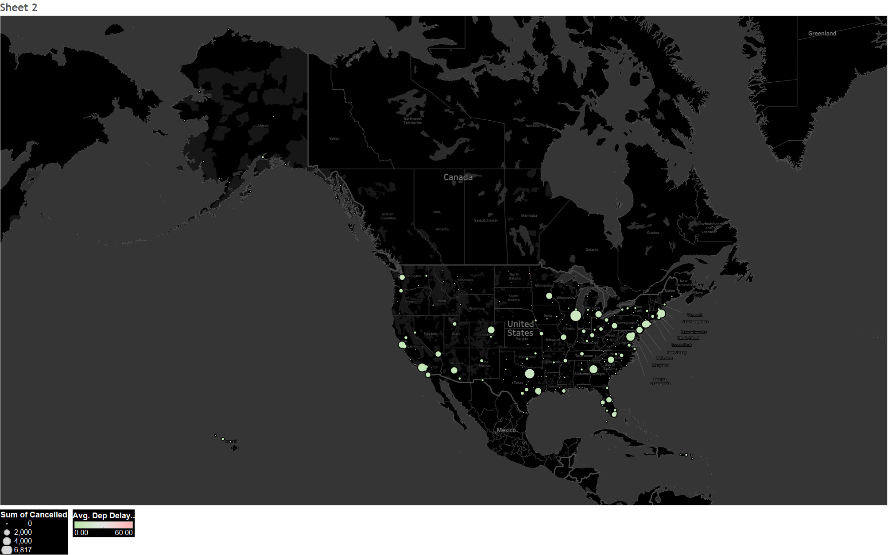

### Assignment 1: Getting Started in Tableau (credit/no credit)
Using one of the provided sample datasets already loaded within Tableau, create four or more views that highlight different features of the data. Experiment with varied views by selecting different dimensions and measures, several visualization types (e.g., scatter plot, bar chart, etc.), changing color and shape encodings, and applying filters. Provide screen captures of each of the views with clear labels describing the axes and variables. No additional text is needed. This is a credit/no credit assignment.

