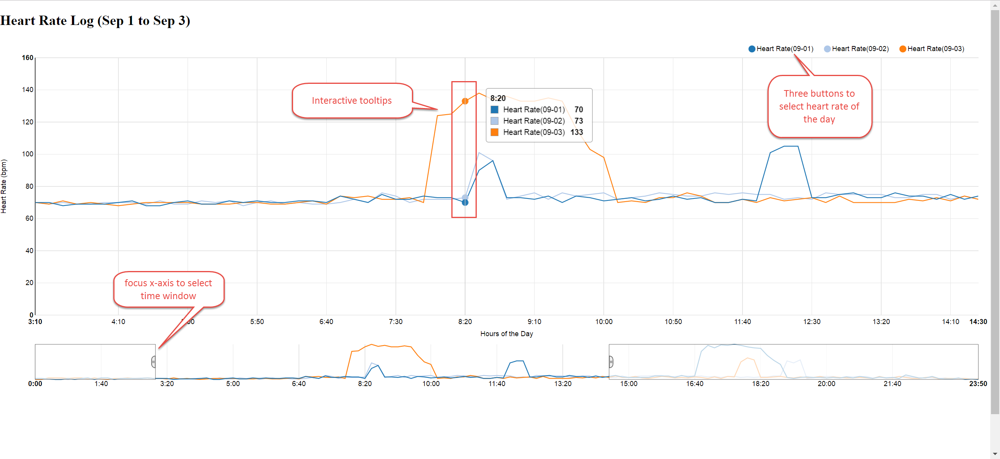

### Assignment 4: Interactive Visualization with D3

Using JavaScript and D3 (and no other graphing libraries), create an interactive version of the static D3 visualization you created for assignment 3. You will need to give it at least two modes of interaction using D3’s facilities for behaviors or transitions. Create one interaction that uses a button and one that doesn’t.  Post your finished piece on the I School web server and turn in a screen capture with the URL. (Instructions for using your I School web site are under Coursework/Additional Resources.)  Make sure the live version is accessible to your instructor. 

------------------------

### Line with Focus Chart

This chart includes three interactions:  

**1. Selections**: three radio button to select the heart rate data for one or more days.   
**2. Overview and Detail style**: there are two charts, the top chart provide the zoom-in view. the bottom chart provides overdetail of the heart rate from 00:00 AM to 11:59 PM.  
**3. Tooltips and selection guide**: Tooltips shows the heart rate for selected dates and time. Small circles and grid line highlights the mouse selection.   

